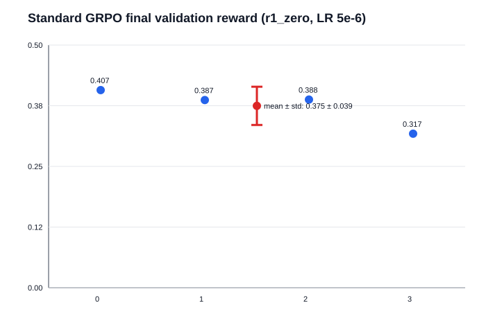
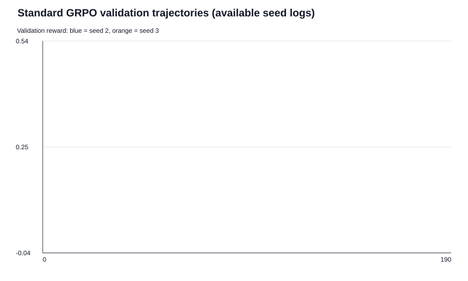
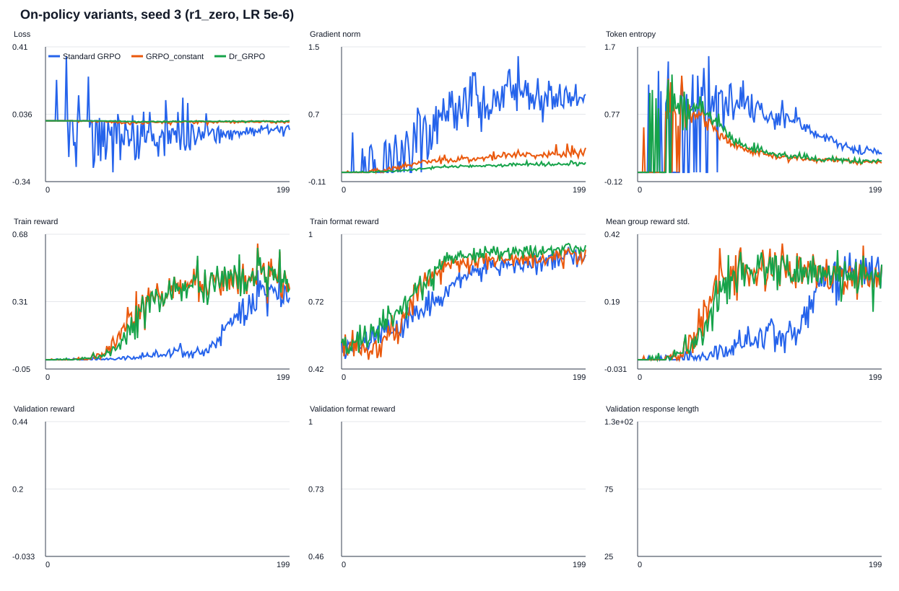
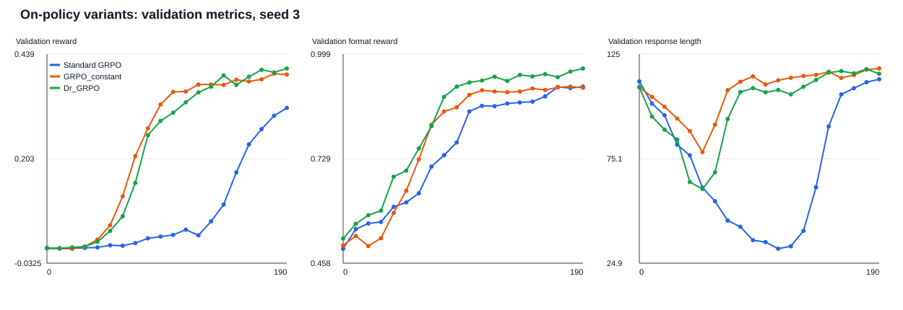

# Experiments

## 1-) OLMo-2-0425-1B GSM8K prompting baselines

**Model:** `allenai/OLMo-2-0425-1B`  
**Dataset:** GSM8K test set (1,319 questions)  
**Run:** Modal GPU, seed 0, temperature 1.0, top-p 1.0, maximum 512 tokens. Raw prompts, responses, and rewards are stored in `prompting_baselines.json`.

Three prompts were evaluated:

1. `question_only`: only the question; the final answer is expected inside `\boxed{...}`.
2. `r1_zero`: zero-shot prompting with the `<think>...</think><answer>...</answer>` format.
3. `r1_zero_three_shot`: the same R1 format with three worked few-shot examples.

| Prompt | Correct: format=1, answer=1 | Formatted incorrect: format=1, answer=0 | Unformatted: format=0, answer=0 |
|---|---:|---:|---:|
| `question_only` | 2 (0.15%) | 235 (17.82%) | 1082 (82.03%) |
| `r1_zero` | 1 (0.08%) | 850 (64.44%) | 468 (35.48%) |
| `r1_zero_three_shot` | 247 (18.73%) | 1006 (76.27%) | 66 (5.00%) |

For each prompt, the first ten formatted-incorrect and unformatted outputs were manually inspected. In both categories, **0/10** inspected responses were actually correct but parsed incorrectly by the grader.

### Observations

- Providing only the question is insufficient: the model usually produces unrelated, incomplete, or malformed continuations.
- `r1_zero` makes the output more likely to follow the requested tag format, but does not improve mathematical correctness.
- The three-shot few-shot prompt sharply reduces unformatted outputs and increases the number of correct answers to 247. However, most responses are still mathematically incorrect despite having the correct format.

### Supporting examples

- `question_only`, correct: for the question where 20% of rental cars are semi-automatic, the model produced `\boxed{20}`.
- `question_only`, unformatted: for “James decides to run 3 sprints...”, the model only produced “Write your answer below to the answer above”; the correct answer is 540 meters.
- `r1_zero`, formatted incorrect: for the duck-egg question, the model repeated the question inside the `<answer>` tag; the correct revenue is $18.
- `r1_zero_three_shot`, correct: for the sprint question, the model reasoned `3 × 60 × 3 = 540` and produced `<answer> 540 </answer>`.
- `r1_zero_three_shot`, formatted incorrect: for the duck-egg question, the model produced `<answer> $120 </answer>`; the correct answer is $18.

## 2-) Variance of the policy-gradient estimator

Let \(A \sim \mathrm{Bernoulli}(p)\), where \(p=\sigma(\theta)\). Therefore, \(A=1\) with probability \(p\), and the reward is \(r(A)=\mathbb{1}\{A=1\}=A\).

For a Bernoulli policy,

\[
\log \pi_\theta(A)=A\log p+(1-A)\log(1-p).
\]

Because \(\frac{\partial p}{\partial\theta}=p(1-p)\), differentiating gives the score function

\[
\nabla_\theta \log \pi_\theta(A)=A-p.
\]

For one sampled action, the policy-gradient term is

\[
X=r(A)\nabla_\theta\log\pi_\theta(A)=A(A-p).
\]

There are only two possible outcomes:

\[
X=
\begin{cases}
1-p, & A=1 \quad (\text{probability }p),\\
0, & A=0 \quad (\text{probability }1-p).
\end{cases}
\]

Thus,

\[
\mathbb{E}[X]=p(1-p),
\qquad
\mathbb{E}[X^2]=p(1-p)^2.
\]

So the variance of one sample is

\[
\begin{aligned}
\mathrm{Var}(X)
&=\mathbb{E}[X^2]-\mathbb{E}[X]^2 \\
&=p(1-p)^2-[p(1-p)]^2 \\
&=p(1-p)^3.
\end{aligned}
\]

The estimator is the average of \(n\) independent samples,

\[
\hat g=\frac{1}{n}\sum_{i=1}^n X_i.
\]

Averaging \(n\) independent samples divides the variance by \(n\). Therefore,

\[
\boxed{\mathrm{Var}(\hat g)=\frac{p(1-p)^3}{n}}.
\]

**No code is needed** for this part: the deliverable asks for a symbolic expression and derivation, which are given above.

## 3-) GRPO GSM8K smoke experiment

**Model:** `allenai/OLMo-2-0425-1B`  
**Run:** Modal, two B200 GPUs, seed 0, 50 rollout/training steps, group size 8, rollout/train batch size 256, gradient accumulation 32.  
**Prompt/reward:** `r1_zero` with `r1_zero_reward_fn`.  
**W&B:** https://wandb.ai/semioz/cs336-grpo-gsm8k/runs/fah5xd3e

The initial smoke run produced identical completions within each group because a fixed seed was sent with every vLLM completion request. This made all group-normalized advantages zero, so the loss and gradient norm were zero. The training sampler was corrected to omit the per-request seed; the vLLM server still receives seed 0 once for run-level reproducibility.

The corrected 50-step run learned successfully. Group reward variation and gradients became nonzero, and both training and validation reward increased:

| Step | Mean training reward | Mean group std. | Validation reward | Validation format reward |
|---:|---:|---:|---:|---:|
| 10 | 0.0000 | 0.0000 | 0.0068 | 0.5518 |
| 20 | 0.0117 | 0.0331 | 0.0117 | 0.7061 |
| 30 | 0.1172 | 0.1769 | 0.1074 | 0.8037 |
| 40 | 0.2578 | 0.3167 | 0.2920 | 0.8643 |
| 49 | 0.5078 | 0.3264 | — | — |

At step 49, the format reward was 0.9766, gradient norm was 0.8203, and token entropy was 0.2051. This verifies that the GRPO loop now receives diverse within-group rollouts and performs nonzero policy updates.

## 4-) Standard on-policy GRPO across four seeds

Using the suggested hyperparameters, four independent 200-step Modal runs were completed with the zero-shot `r1_zero` prompt. All runs used 6,400 training examples, 1,024 validation examples, batch size 256, group size 8, gradient accumulation 32, AdamW with learning rate `1e-5`, temperature 1.0, and maximum generation length 512.

| Seed | Final train reward | Final validation reward | Final validation format reward | Validation response length |
|---:|---:|---:|---:|---:|
| 0 | 0.4492 | 0.4297 | 0.9580 | 117.3 |
| 1 | 0.3789 | 0.4375 | 0.9521 | 126.9 |
| 2 | 0.1797 | 0.1270 | 0.9717 | 28.2 |
| 3 | 0.4688 | 0.4326 | 0.8945 | 162.1 |
| Mean | 0.3691 | **0.3567** | 0.9441 | 108.6 |

The final validation reward has sample standard deviation **0.1532**, demonstrating substantial seed variance. Seeds 0, 1, and 3 learned strong answer accuracy (about 43%), while seed 2 mostly learned the requested tag format without comparable correctness. Nevertheless, the four-seed mean validation reward of **35.67%** exceeds the required 25% final validation accuracy.

## 5-) Learning-rate sweep

The standard on-policy result above provides the `1e-5` baseline with four seeds. The lower `5e-6` learning rate was then completed across four seeds and is the standard GRPO baseline for later algorithm-variant experiments. `2e-5` was evaluated with two seeds to conserve compute. All runs used the same `r1_zero` prompt and other hyperparameters.

| Learning rate | Seeds | Final validation rewards | Mean | Sample std. |
|---:|---:|---|---:|---:|
| `5e-6` | 0, 1, 2, 3 | 0.4072, 0.3867, 0.3877, 0.3174 | **0.3748** | **0.0394** |
| `1e-5` | 0, 1, 2, 3 | 0.4297, 0.4375, 0.1270, 0.4326 | 0.3567 | 0.1532 |
| `2e-5` | 0, 1 | 0.4834, 0.0732 | 0.2783 | 0.2900 |

`5e-6` gave the highest observed four-seed mean reward and much lower variance than `1e-5`. `2e-5` was unstable: one seed achieved 0.4834, but the other achieved only 0.0732 despite a format reward of 0.9961. Therefore, `5e-6` is the learning rate used for subsequent experiments.

## 6-) Length normalization and Dr. GRPO

Standard GRPO first averages token losses within each completion, then averages completions. This gives every completion equal total weight, regardless of whether it contains 10 or 500 tokens. Its advantage is a more stable gradient scale and equal sequence-level influence. Its drawback is that it changes the policy-gradient estimator: each token in a short response receives a larger effective weight than each token in a long response. For a task where correct reasoning genuinely needs a long derivation, this can underweight the long correct trajectory and create a preference for short responses.

Constant normalization instead sums the token-level score terms and divides the entire batch by one fixed constant, typically \(Z = BGL\). A long completion therefore contributes through all of its sampled tokens, as in the trajectory score-function gradient. This removes the relative reweighting caused by sequence length and keeps the normalization constant across batches. However, long completions can dominate the update, increasing gradient variance and potentially amplifying verbosity when length is correlated with reward for incidental reasons.

Dr. GRPO removes both deviations highlighted in the paper. It uses the group-mean baseline \(r_{i,j}-\mu_i\) without dividing by the group reward standard deviation, eliminating standard-deviation normalization bias: groups with low reward variance are no longer artificially magnified. It also uses constant loss normalization rather than per-sequence length normalization, eliminating the length-dependent reweighting. Thus, its purpose is to remove both the standard-deviation advantage-normalization bias and the sequence-length-normalization bias, while retaining the group-mean baseline for variance reduction.

## 7-) RFT versus Dr. GRPO

For binary rewards, RFT gives every correct rollout coefficient 1 and every incorrect rollout coefficient 0: it increases the log-probability of only verified-correct responses. In a group with \(k\) correct responses out of \(G\), Dr. GRPO instead assigns each correct response coefficient \(1-k/G\) and each incorrect response coefficient \(-k/G\). It therefore explicitly increases correct responses relative to the incorrect alternatives in the same group.

Their expectations are not exactly equal when \(\mu\) includes the sampled rollout itself. Since the other rewards are independent of a rollout's score function and \(\mathbb{E}[\nabla\log\pi_\theta]=0\), Dr. GRPO has expectation \((G-1)/G\) times the RFT expectation. They have the same expected direction, and the constant factor can be absorbed into the learning rate. A leave-one-out group mean would remove this factor.

Dr. GRPO should generally have lower variance because centering rewards with a group baseline uses the relative quality of the rollouts rather than a sparse 0/1 indicator. It is especially useful when a group mixes correct and incorrect answers: it both reinforces the correct answer and suppresses the incorrect alternatives. RFT is simpler and cheaper because failed rollouts need not be scored by the training model, and it can be attractive when verified successes are plentiful and high quality. However, it gives no update when a group has no correct response, and unlike RFT, Dr. GRPO also gives no update when every response in a group has the same reward; this is the price of its purely relative signal.

## 8-) GRPO_constant initial result

A 200-step `GRPO_constant` run was completed with seed 3, the `r1_zero` prompt, and learning rate `5e-6`. It uses the standard mean baseline and standard-deviation advantage normalization, but changes loss aggregation from sequence normalization to constant normalization with \(Z=256\times512=131{,}072\).

| Method | Seed | Final validation reward | Final format reward | Validation response length |
|---|---:|---:|---:|---:|
| Standard GRPO (sequence normalization) | 3 | 0.3174 | 0.9150 | — |
| GRPO_constant | 3 | 0.3926 | 0.9121 | 118.4 |
| Dr_GRPO | 3 | **0.4063** | **0.9619** | 115.8 |

On seed 3, constant normalization improved validation reward by 0.0752 while leaving format reward nearly unchanged. Removing standard-deviation advantage normalization improved the reward by a further 0.0137. These are one-seed smoke results only; additional seeds are needed before concluding that either variant outperforms standard GRPO.

### Available plots and compute-limited comparison

The four-seed standard GRPO baseline has final validation rewards 0.4072, 0.3867, 0.3877, and 0.3174, for mean **0.3748** and sample standard deviation **0.0394**. It is a stable reference above the 25% target.

The available per-step logs for seeds 2 and 3 both improve from near-zero reward to 0.3877 and 0.3174 respectively. The final-value plot includes all four seeds; the trajectory plot is limited to the two retained per-step logs.

For seed 3, both constant-normalized variants improve validation reward much earlier than sequence-normalized standard GRPO. Dr. GRPO ends highest at 0.4063, followed by GRPO_constant at 0.3926 and standard GRPO at 0.3174. The two variants also reach high format reward earlier and retain response lengths near 116--118 tokens; standard GRPO temporarily collapses to short responses before recovering. Loss magnitudes are not directly comparable across sequence and constant normalization because their denominators differ.

A qualitative rollout shows the same pattern. At step 0, standard GRPO answered the business-hours problem with malformed tags and an incorrect answer. At step 160, it correctly solved the balloon problem: \(20-3=17\), \(15-2=13\), and final answer 30. Dr. GRPO similarly progressed from malformed initial output to the correctly tagged answer 30 at step 160.

GPU compute ended before additional seeds, RFT, and MaxRL could be run. Therefore, the seed-3 variant results are useful smoke evidence only. They do not establish that Dr. GRPO or GRPO_constant outperforms standard GRPO in expectation, and no conclusion can be drawn about RFT or MaxRL.

## 9-) Pairwise importance-reweighting surrogate objective

Assume an even response length \(L\). For each pair index \(k\in\{1,\ldots,L/2\}\), define a surrogate policy that uses the current policy only for tokens \(2k-1\) and \(2k\), and the stale policy everywhere else:

\[
\tilde\pi_{\theta}^{(k)}(y\mid x)=
\left(\prod_{s<2k-1}\pi_0(y_s\mid x,y_{<s})\right)
\pi_\theta(y_{2k-1}\mid x,y_{<2k-1})
\pi_\theta(y_{2k}\mid x,y_{<2k})
\left(\prod_{s>2k}\pi_0(y_s\mid x,y_{<s})\right).
\]

The pairwise estimator optimizes the average expected reward under these \(L/2\) surrogate policies:

\[
J_{\mathrm{pair}}(\theta)=
\mathbb E_{x\sim\rho}\left[
\frac{2}{L}\sum_{k=1}^{L/2}
\mathbb E_{y\sim\tilde\pi_{\theta}^{(k)}(\cdot\mid x)}
[r(y\mid x)]
\right].
\]

For one pair, the score-function gradient is

\[
\nabla_\theta\mathbb E_{\tilde\pi_\theta^{(k)}}[r]
=
\mathbb E_{\tilde\pi_\theta^{(k)}}
\left[r(y\mid x)\nabla_\theta
\log\left(\pi_\theta(y_{2k-1}\mid x,y_{<2k-1})
\pi_\theta(y_{2k}\mid x,y_{<2k})\right)\right].
\]

Importance sampling this expectation with \(y\sim\pi_0\) gives the ratio \(\tilde\pi_\theta^{(k)}(y\mid x)/\pi_0(y\mid x)\). All non-pair factors cancel, leaving exactly the product of the two adjacent token ratios in the estimator. Averaging these gradients over pairs gives Equation (55). Thus, pairwise reweighting is not the expected reward of the fully current policy; it is the expected reward averaged over policies that replace one adjacent token pair at a time.

## 10-) Token-level off-policy importance reweighting

`compute_policy_gradient_loss` now supports the following token-level off-policy objectives. Let \(\rho_t=\exp(\log\pi_\theta(y_t\mid\cdot)-\log\pi_0(y_t\mid\cdot))\), where \(\pi_0\) generated the rollout.

- `noclip` returns the negative surrogate \(-\rho_t A\).
- `grpo` returns \(-\min(\rho_t A,\operatorname{clip}(\rho_t,1-\epsilon,1+\epsilon)A)\), the PPO/GRPO clipped token-level surrogate.

The training script accepts `--importance-reweighting-method noclip|grpo` and `--cliprange`. After generating a rollout and before the optimizer update, it scores the exact prompt-response sequences with the current pre-update policy under `torch.no_grad()` and saves these values as `old_log_probs`. `grpo_train_step` aligns these stale log probabilities with each active microbatch before calculating the new token probabilities and the ratio.

Verified locally: on-policy loss, token-level `noclip` and `grpo` losses, `noclip` and `grpo` train-step variants, and script CLI tests all pass. GSPO remains intentionally unimplemented because it is the separate sequence-level-reweighting problem.

## 11-) Bias--variance trade-off in importance reweighting

No importance reweighting has the lowest variance because it introduces no likelihood-ratio weights, but it is the most biased whenever the current policy has moved away from the stale rollout policy. It is reasonable when rollouts are nearly on-policy, such as after a small update or frequent weight synchronization.

PPO/GRPO-style token-level reweighting corrects each token by its own old-to-new likelihood ratio. It reduces the stale-policy bias relative to no reweighting, while clipping prevents rare large ratios from dominating an update. Clipping and ignoring the rest of the sequence still leave bias, but this is often a useful middle ground for moderately stale data and stable training.

GSPO uses one clipped sequence-level ratio, formed from the geometric mean of token ratios. It better reflects how the current policy differs over the complete response, including prefix and suffix changes that token-level reweighting ignores. This can reduce trajectory-level bias, especially for long reasoning responses whose reward depends on the whole sequence. However, it is more sensitive to noisy log-ratio estimates across the response and can have higher variance; the geometric mean and clipping deliberately temper this instability. Thus the usual spectrum is: no reweighting has lowest variance and highest bias, clipped token-level reweighting is a middle ground, and clipped GSPO aims for more trajectory-faithful correction at potentially higher variance.
